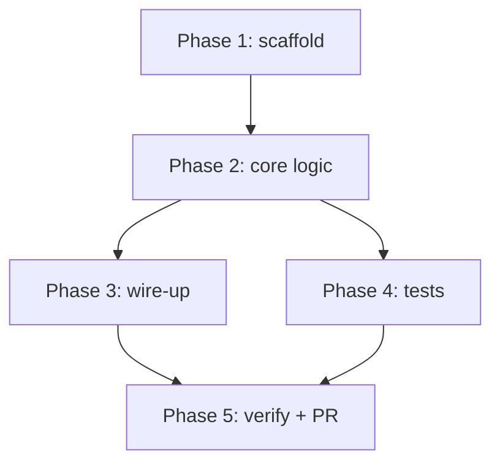

# <Feature name>

| Branch | Status | Linear | Updated |
|---|---|---|---|
| `<branch-short-name>` | draft | <BOU-xxxx> | <YYYY-MM-DD> |

*Status flow: draft → agreed → executing → done*

## Goal

One or two sentences. What does "done" make possible that isn't possible today?

## Constraints & invariants

Things that must stay true. Review attention is cheapest to spend here.

- <invariant>
- <invariant>

## Definition of done

The acceptance check — how we'll know it worked, ideally a command or observable behavior.

- [ ] <observable outcome / passing test / screenshot>

## Approach

The shape of the solution in prose — the "why this way," not the line-by-line. Reviewing
this paragraph is where you catch a wrong-direction plan early.

## Phases

### Phase 1 — <name>

- [ ] task
- [ ] task

### Phase 2 — <name>

- [ ] task

### Phase 3 — <name>

- [ ] task

## Open questions & decisions

> [!question] <question for the human>
> My read plus a recommendation. Answer inline, right here.

> [!success] Decision — <what was decided>
> Why we chose it, so it isn't re-litigated later.

## Risks & rollback

- <what could go wrong> — <the cheap way back>
